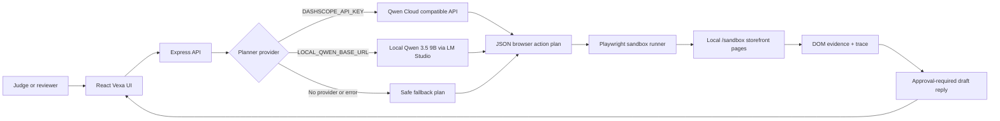

# Vexa Autopilot Architecture

Vexa Autopilot is a public-safe Qwen browser-agent sandbox. It demonstrates model-planned browser actions, deterministic tool execution, evidence capture, and a human approval gate before any customer-facing action.

## Runtime Components

- **React UI**: Shows the business objective, plan steps, evidence report, approval card, and floating V agent dock.
- **Express API**: Hosts `/api/health`, `/api/workflows/plan`, `/api/browser-agent/run`, and the local `/sandbox/*` pages.
- **Qwen adapter**: Uses the OpenAI-compatible DashScope/Qwen endpoint through `server/qwen-cloud.mjs`.
- **Local Qwen adapter**: Uses LM Studio or another OpenAI-compatible local server for Qwen 3.5 9B.
- **Playwright runner**: Executes only allowlisted local sandbox URLs and actions: `navigate`, `click`, `extract`, `pause_for_approval`.
- **Fallback plan**: Keeps the demo runnable without credentials while clearly marking planner fallback state.

## Safety Model

- No real browser profile, cookies, customer data, or external websites are used.
- The runner validates every navigation against the active sandbox origin.
- The send/reply step never executes automatically; it pauses for human review.
- Provider errors are surfaced as planner fallback, not hidden as successful Qwen execution.

## Alibaba Cloud Fit

The app is container-ready for Alibaba Cloud deployment:

- `Dockerfile` builds the React app and serves it from the same Express process.
- `VEXA_HOST=0.0.0.0` and `VEXA_API_PORT=8080` are used for container ingress.
- `DASHSCOPE_API_KEY`, `DASHSCOPE_BASE_URL`, `QWEN_MODEL`, and `VEXA_FORCE_MOCK=0` enable Qwen Cloud planning.
- `server/qwen-cloud.mjs` is the code file demonstrating Qwen Cloud API usage.
